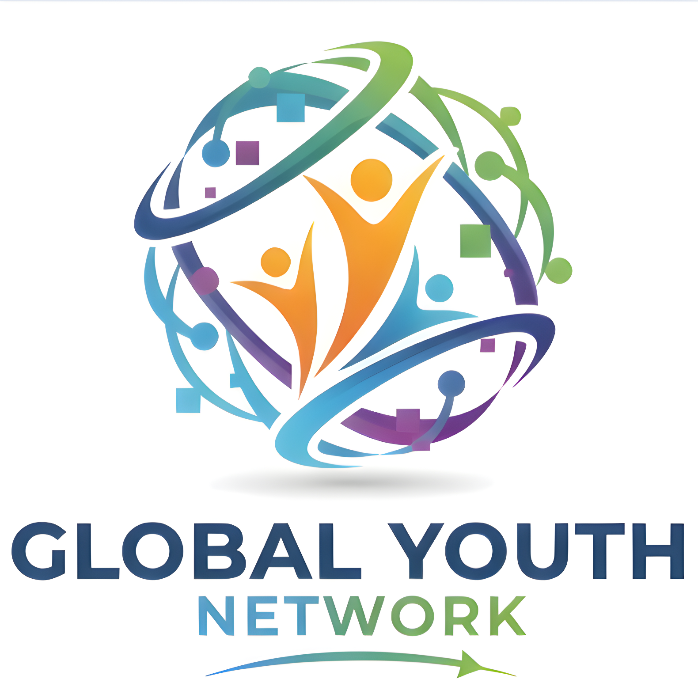

  

# 🌍 GYN — Global Youth Network

> **Connecting Youth. Empowering Future. Creating Impact.**

**GYN (Global Youth Network)** adalah jaringan pemuda global yang berfokus pada kolaborasi, pengembangan kapasitas, dan aksi nyata untuk menciptakan perubahan positif di tingkat lokal hingga internasional.

🔗 Website resmi: https://gyn.co-id.id/

---

## ✨ Tentang GYN

GYN hadir sebagai wadah bagi generasi muda untuk:
- 🌱 Mengembangkan potensi diri
- 🤝 Berkolaborasi lintas negara & budaya
- 🚀 Menginisiasi program sosial, edukasi, dan kepemudaan
- 🌐 Membangun jejaring global yang berkelanjutan

Kami percaya bahwa **pemuda adalah agen perubahan**, dan masa depan dunia dibentuk oleh kolaborasi hari ini.

---

## 🎯 Fokus Utama

- **Youth Empowerment**
- **Leadership Development**
- **Global Networking**
- **Social & Community Projects**
- **Education & Capacity Building**

---

## 🧭 Visi

Menjadi jaringan pemuda global yang inklusif, progresif, dan berdampak dalam membangun masa depan yang berkelanjutan.

---

## 🎓 Misi

- Mendorong peran aktif pemuda dalam pembangunan global  
- Menjadi platform kolaborasi lintas sektor dan negara  
- Mengembangkan kepemimpinan dan kompetensi generasi muda  
- Menghasilkan aksi nyata yang berdampak bagi masyarakat  

---

## 🌐 Keterlibatan & Kolaborasi

Kami terbuka untuk:
- 🤝 Partnership & kolaborasi program  
- 🌍 Kegiatan kepemudaan internasional  
- 📢 Kampanye sosial & edukatif  
- 🧠 Diskusi, riset, dan inovasi berbasis pemuda  

---

## 📬 Kontak & Informasi

Untuk informasi lebih lanjut, kunjungi:
- 🌐 Website: https://gyn.co-id.id/

Atau hubungi kami melalui kanal resmi yang tersedia di website.

---

## 🤍 Kontribusi

Kami menyambut kontribusi dan kolaborasi dari individu maupun organisasi yang memiliki visi sejalan dengan GYN.

> **Together, youth can shape a better world.**

---

© 2026 — **Global Youth Network (GYN)**  
All rights reserved.
